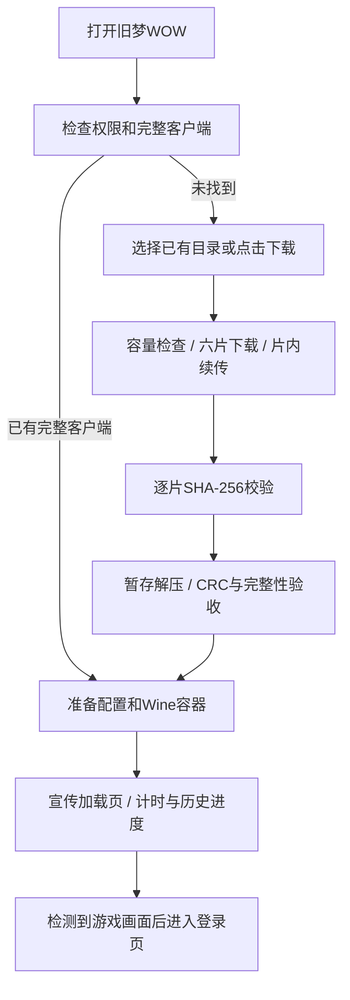

# 旧梦WOW：开发维护手册

整理日期：2026-10-08。现行功能截至2026-10-08键盘入口与原生模式修复（阶段编号v13）。`v7`～`v13`是开发阶段标记；Android包版本仍为`0.1.2 / versionCode 3`，Lua触控插件为v8。

玩家安装与设置见[安装使用手册](OldDreamWOW_New_Device_Setup_Checklist.md)，历史原文与验证截图见[历史索引](archive/README.md)。下列六分片与旧加载页测试保留原验收日期；10月8日新增键盘入口、ConsolePort隔离测试和S10原生模式验收，见[v13记录](archive/history/OldDreamWOW_Keyboard_and_Native_Mode_20261008.md)。

## 1. 模块与上游升级边界

独立实现集中在`app/src/main/java/com/winlator/wowmobile/`和`app/src/main/assets/wowmobile/`；原生触控状态机位于`app/src/main/java/com/winlator/wow/`。公共运行器保留必要桥接补丁，升级上游时需逐项检查。

| 文件/模块 | 责任 |
| --- | --- |
| [WowMobileActivity](../app/src/main/java/com/winlator/wowmobile/WowMobileActivity.java) | 客户端发现、权限、后台授权入口、安装进度、自动启动调度 |
| [ClientInstallService](../app/src/main/java/com/winlator/wowmobile/ClientInstallService.java) | 单个前台安装任务、通知、WakeLock、暂停及终态 |
| [ClientInstaller](../app/src/main/java/com/winlator/wowmobile/ClientInstaller.java) | 六片下载/校验、续传、容量、安全解压、完整性和目录发布 |
| [GameFolder](../app/src/main/java/com/winlator/wowmobile/GameFolder.java) | 客户端根目录与必需资源检查 |
| [Provisioner](../app/src/main/java/com/winlator/wowmobile/Provisioner.java) | 初始化配置、按键、已知原版Lua的升级 |
| [WowContainerHelper](../app/src/main/java/com/winlator/wowmobile/WowContainerHelper.java) | Wine容器、盘符、快捷方式及触控配置 |
| [WowResolution](../app/src/main/java/com/winlator/wowmobile/WowResolution.java) / [OldDreamIntegration](../app/src/main/java/com/winlator/wowmobile/OldDreamIntegration.java) | 720高度分辨率和旧梦运行器入口 |
| [OldDreamStartupView](../app/src/main/java/com/winlator/wowmobile/OldDreamStartupView.java) | 宣传加载页、采样、耗时记录和手动查看 |
| [StartupProgress](../app/src/main/java/com/winlator/wowmobile/StartupProgress.java) / [StartupFrameReadiness](../app/src/main/java/com/winlator/wowmobile/StartupFrameReadiness.java) | 历史耗时曲线、计时格式和场景判定 |
| [WowNativeTouchController](../app/src/main/java/com/winlator/wow/WowNativeTouchController.java) | 原生手势状态机与输入释放 |
| [TouchCoordinateMapper](../app/src/main/java/com/winlator/renderer/TouchCoordinateMapper.java) | 实际viewport、zoom、sceneOffset与触摸坐标逆映射 |
| [ConsolePortIsolation](../app/src/main/java/com/winlator/wowmobile/ConsolePortIsolation.java) | 启动前可逆隔离/恢复旧手柄插件，拒绝目录冲突与覆盖 |
| [OldDreamKeyboardButton](../app/src/main/java/com/winlator/wowmobile/OldDreamKeyboardButton.java) | 顶部键盘图标，复用系统键盘入口，保留Wine焦点 |
| [WoWMobileTouchUI.lua](../app/src/main/assets/wowmobile/WoWMobileTouchUI.lua) | 原生模式的动作栏、字体、按键及目标保留 |

上游升级重点：`TouchpadView`的鼠标注入、`InputControlsView`按pointer ID分流、`GLRenderer`/坐标映射、`XServerDisplayActivity`的Native启用/暂停释放/加载页入口、`RootFSInstaller`完成回调。不要恢复按整个屏幕比例直接换算触点的旧逻辑；OpenGL底部原点与Android顶部原点需要明确转换。

## 2. 启动与安装流程



目录查找依次考虑已选择路径、`/sdcard/Download/OldDream/client`、`/sdcard/WoW335CN`。完整性检查包括Wow.exe、五个固定基础MPQ大小及必要补丁/语言资源。存在但不完整的目标目录不被安装任务覆盖。

### 六分片与缓存

源目录：`E:\rxdev\webhost\wow`；URL基址：`https://cloud.f-li.cn:6500/wow/WoW-3.3.5a-zhCN.zip`，实际请求追加`.001`～`.006`，不请求已移除的单ZIP文件。

| 分片 | 字节数 |
| --- | ---: |
| .001～.005，每片 | 3,670,016,000 |
| .006 | 1,632,143,800 |
| 合计 | 19,982,223,800 |

这些文件是普通ZIP按字节切分。顺序追加到同一`client.zip.part`，各片SHA-256通过后切换为`client.zip`；无需第二份20GB合并副本。当前长度及SHA清单固定在`ClientInstaller`，更换客户端版本需同步更新清单及完整性规则，不能只替换服务器文件。

- 缓存：`/sdcard/Download/OldDream/.install`；元数据：`download.properties`；解压临时目录：`staging`。
- 累计字节定位分片，HTTP Range使用片内偏移；已完成片先校验再复用。
- HTTP 200忽略Range时重下当前片，保留前面的正确片。错误Content-Range、404或网络中断保留已有下载；SHA失败截断至该片起点，继续时重下该片。
- 旧单ZIP缓存URL与总大小匹配时可迁移，仍逐片SHA校验；完整缓存可复用解压。
- 低于20 GB先提示；实际预检查为`2 × 压缩总大小 + 3 GiB预留 − 已缓存字节`，全新安装建议45 GB。解压还按ZIP条目总大小复查空间。
- 解压检查路径越界、重复路径、加密/符号链接、条目大小和CRC。发布前验收完整客户端，然后同卷目录切换；成功后清理安装缓存。
- 下载/校验/解压可暂停；下载保留断点，解压重启时清理安装器暂存目录重新解压。前台服务与后台授权降低被系统终止的概率；权限仍由用户确认。

### 游戏运行加载页

使用网站`wow-server/website/static/hero.webp`的旧梦宣传图，覆盖Play后运行器黑屏阶段。底部`mm:ss`为真实计时，百分比按上一次成功耗时推进；提示“预计30–120秒”，严格超过120秒提供查看游戏画面入口。

历史配置：App私有`olddream_startup / last_success_ms`。没有历史时基准60秒；到上次成功耗时时为90%，之后渐近99.50%。每750ms通过PixelCopy取96×54游戏Surface样本，连续两次存在场景后到100%并收起。黑屏、孤立指针和单色清屏不算完成；手动查看或中断不覆盖成功记录。退出后释放Bitmap和回调。

## 3. 原生触控与界面现状

| 项目 | 当前规则 |
| --- | --- |
| 默认模式 | Native；Legacy可选。Native启动前把ConsolePort前缀目录隔离到`.olddream-consoleport`；Legacy恢复目录并启用ConsolePort/ConsolePortBar核心插件 |
| 分辨率 | 高720，物理横屏比例计算偶数宽；16:9为1280×720，S10的19:9为1520×720，20:9为1600×720；游戏与容器同步 |
| 方向/按键 | W/S前后，A/D横移，Space跳跃，Tab最近敌人；按当前绑定集保存 |
| 轻点 / 快速拖动 | 绝对坐标左键 / 右键相对位移转镜头 |
| 长按 / 长按后拖动 | 松手右键 / 绝对坐标左键拖物品 |
| 双指竖滑 | 滚轮；完整多指操作仍需手测 |
| 手势参数 | 点击保持120ms；长按默认380ms，可选300/380/450/550；镜头默认1.0，可选0.7/1.0/1.3/1.6 |
| 虚拟控件 | 方向盘、中文目标/跳跃；方向盘计算描边后完整贴左缘，仅迁移旧默认坐标，保留自定义位置 |
| 右侧动作栏 | 原安全按钮每条12格排两列六行，两条合计四列；缩放1.30、gap6，保持槽内容与显隐，脱战重新布局 |
| 命中与目标 | HitRectInsets四边-3 UI单位；登录设置`deselectOnClick=0`，空地保留目标，改选与Esc仍有效 |
| 底栏与背包 | 不强制UIParent整体缩放；底栏缩放上限1.35并按可用宽收敛，保留背包完整显示 |
| 字体 | GameFont最低13；Tooltip正文14/标题16/小字12；前两个聊天窗最低16 |

S10实测目标中心(1258,374)、跳跃(1272,482)，距右栏约2px；这些是S10验证值，不是所有比例的保证。APK不强制打开两条右栏，也不复制技能槽或BigFoot账号选项，见安装使用手册。

插件升级按已知原始旧Lua精确匹配（v2/v3/v4/v5/v5-early/v6/v7/v8-preview）；已知v1/v4 TOC也可迁移，保证模式脚本加载；玩家修改过的Lua/TOC保留。不要用直接覆盖所有AddOns文件的方式更新。

## 4. 构建、发布与定向验证

现有环境：JDK17、Gradle wrapper、compileSdk34/minSdk26/targetSdk28、NDK24.0.8215888、CMake3.22.1、arm64-v8a。包名`it.wowmobile`。

```powershell
$env:JAVA_HOME='C:\Program Files\Java\jdk-17'
.\gradlew.bat :app:assembleDebug --no-daemon --console=plain
```

输出：`app/build/outputs/apk/debug/app-debug.apk`。已有AGP/SDK和native packaging警告不等于构建失败，按最终退出码和`BUILD SUCCESSFUL`判断。

```powershell
.\tools\build-olddream.ps1 -PublishOnly
Copy-Item -LiteralPath app/build/outputs/apk/debug/app-debug.apk -Destination docs/OldDreamWOW.apk -Force
Get-FileHash docs/OldDreamWOW.apk -Algorithm SHA256
```

发布脚本先复制`.uploading`并校验SHA-256，再替换`E:\rxdev\webhost\wow\OldDreamWOW.apk`；它不会自动更新docs副本，需执行上方复制。省略`-PublishOnly`可由脚本先构建。正式产物保持固定文件名；历史APK仅作本机归档且不提交Git。

定向测试在[app/src/test](../app/src/test/java/com/winlator/wowmobile)：`ClientInstallerTest`、`SplitClientInstallerTest`验证真实HTTP/文件流程；`StartupProgressTest`、`StartupFrameReadinessTest`验证计时/历史/120秒边界和场景判定。坐标映射测试见[TouchCoordinateMapperTest](../app/src/test/java/com/winlator/renderer/TouchCoordinateMapperTest.java)。这些为带main入口的测试，使用JDK17 javac/java执行；安装测试的classpath需当前commons-compress 1.20 JAR，临时目录放`%TEMP%\ai\日期\任务名`。

S10验证使用`D:\home\.shell\android-sdk\platform-tools\adb.exe`、主用户0；安装命令`adb install -r --user 0 app-debug.apk`。保留个人客户端，测试复制品用空目录；结束后恢复原路径、清理自己创建的副本、媒体音量0、常亮关闭、停止App/WoW/Wine并熄屏。

## 5. 已验证范围与待验证项

| 范围 | 历史证据与结论 |
| --- | --- |
| 构建及回归 | 2026-10-07构建成功，原安装与六片HTTP/续传/校验/解压测试通过 |
| S10完整安装 | 六片19,982,223,800字节全部下载校验、2,727条目安全解压、自动进入登录页；安装缓存清空 |
| 实机进程续传 | 第二片内暂停于4,820,450,941字节，关闭App后继续增长至5,214,502,092字节，没有从零开始 |
| 加载页 | 正常启动约47～49秒完成；两分钟前无手动入口，超过两分钟显示；手动查看不污染历史记录 |
| 游戏内输入/UI | S10此前进入世界，验证横移、镜头、长按图标、栏间技能命中、目标保留/切换/Esc、布局和背包完整 |
| 未验证 | 其他手机/GPU/Android版本、完整多指同时移动与镜头、长按拖物品完整手测、真实战斗误触、30分钟持续运行、RootFS全新失败分支 |

2026-10-07下载验收到登录页，没有登录账号或进入角色；恢复原客户端后再次自动进入登录页并完成收尾。具体命令结果、截图和各阶段差异见历史索引。

历史方案中的800×600、960×432、1280×1024、固定宽1280、UI全局1.12、数字技能透明Overlay、ConsolePort默认、英文JUMP/TGT、v10的30秒80%/60秒查看入口、单ZIP下载均已被替代，不作为当前操作说明。

## 6. 客户端源目录与v13验证

PC客户端源：`D:\Program Files\Game\World of Warcraft 3.3.5a CN`。发布分片位于`E:\rxdev\webhost\wow`，Android继续下载六片。10月8日只读核对源AddOns目录及分片ZIP中央目录（2,727条目），两者均不含ConsolePort；S10上的旧ConsolePort来自早期Legacy初始化，当前修复无需更换分片。

`ConsolePortIsolationTest`通过真实文件迁移验证Native隔离、Legacy恢复、重复执行、玩家修改内容保留和同名冲突保护。隔离目标有同名目录时拒绝继续，不覆盖；失败尝试回滚。切换Legacy在游戏内恢复核心插件启用，Legacy整套游戏实机体验本轮未验收。S10原生角色验证确认CP/Bar未加载、Native=true、目标保留=0、A/D横移；键盘打开、关闭及登录输入通过。
