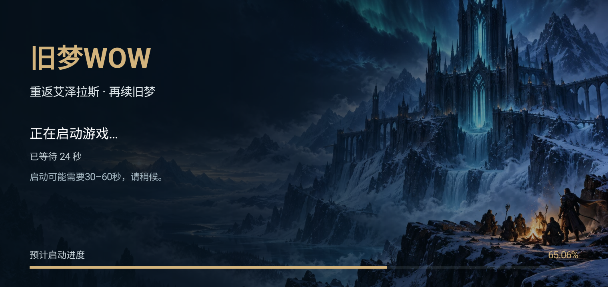
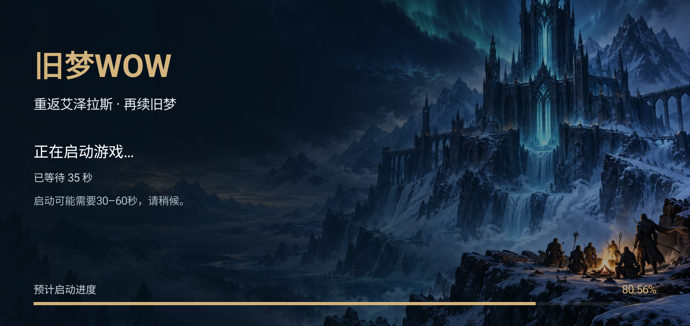
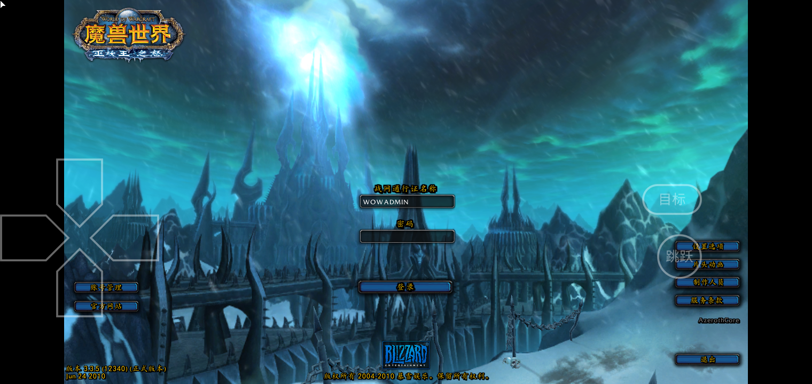
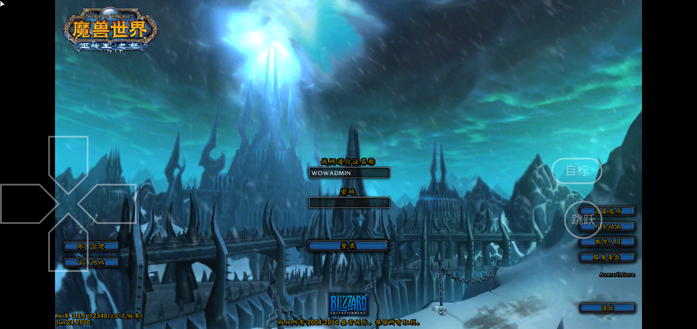
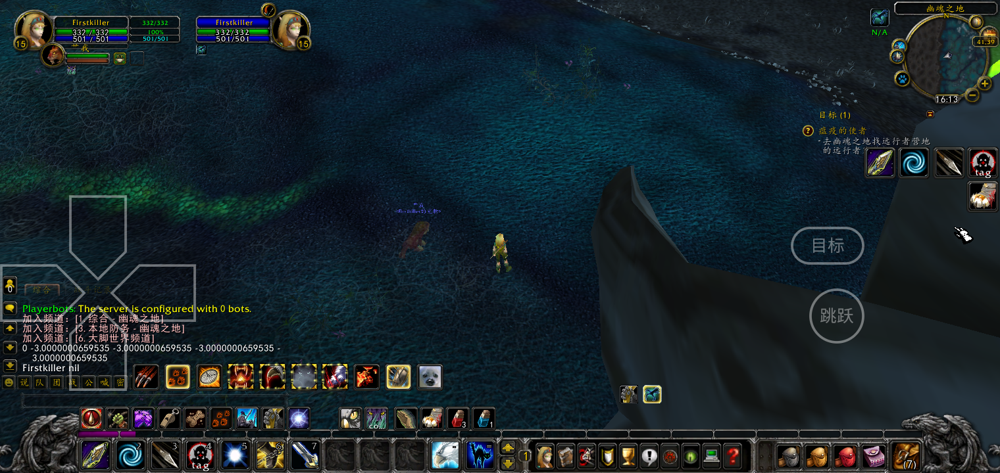
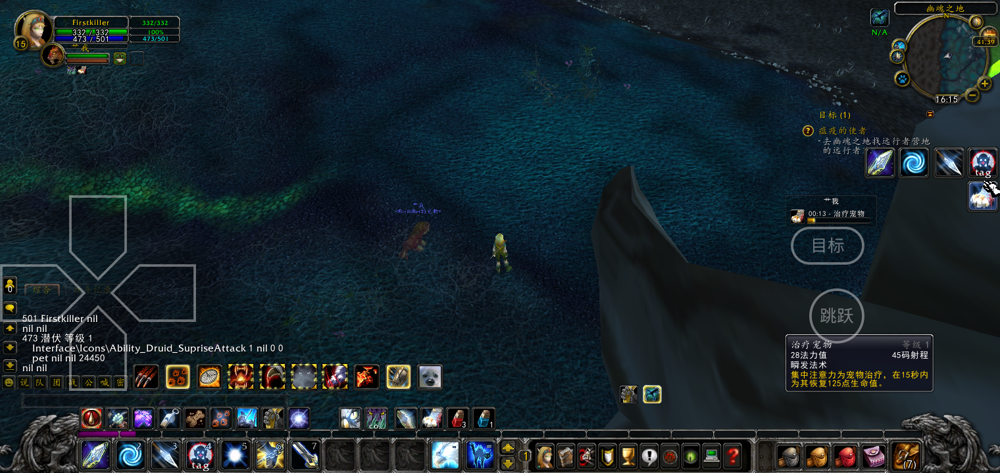
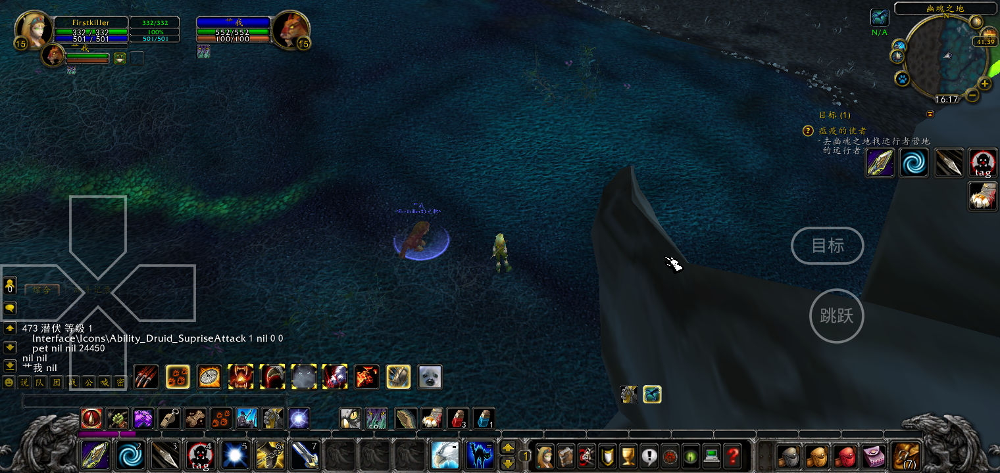
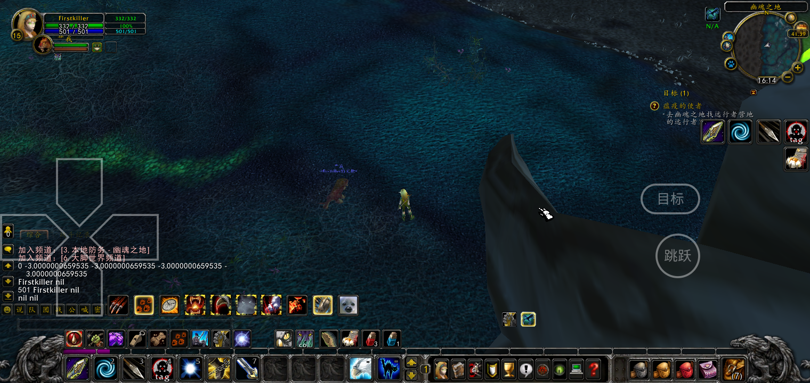

# 旧梦WOW v10：Play后的加载宣传页、技能误触保留目标

## Play到登录画面的加载页

- 覆盖游戏运行界面刚启动、Wine/图形环境尚未给出画面的黑屏阶段；不是只改下载页或客户端检测页。
- 复用`wow-server/website/static/hero.webp`，加入旧梦WOW标题、宣传文案、底部金色进度条、两位小数百分比和真实等待秒数。初始提示“启动可能需要30–60秒，请稍候”。
- 底部标为“预计启动进度”：按时间在前30秒从0推进到80%，随后缓慢增长（31秒约80.11%、60秒约82.99%），最长停留在99.50%。这是等待动画，不代表真实资源加载量；只有检测到游戏画面才显示100.00%，短暂停留后自动进入。手动查看画面不会伪报100%。
- 超过60秒显示“加载耗时较久，仍在等待游戏画面”，提供“查看游戏画面”手动入口，防止个别设备无法自动识别画面时被遮挡。
- 独立`OldDreamStartupView`使用Android PixelCopy读取游戏Surface的96×54缩略样本，每750ms一次。连续两次存在场景内容后淡出；黑屏、孤立鼠标指针和单色初始清屏不会提前结束加载页。
- 图片、文案、动画及判断代码均在wowmobile独立目录；上游`XServerDisplayActivity`仅加导入、替换旧梦启动时通用预加载弹窗条件、调用显示入口。其他运行器路径保留原逻辑。画面出现或退出后停止检查并释放采样Bitmap。

## 点偏技能时保留目标

- 已在升级前的S10复现：`deselectOnClick=1`，先点角色头像选中，再点击场景空地，目标消失。
- Native模式登录时设置`deselectOnClick=0`，启用游戏原有“锁定目标”：点空地保留目标，仍可点其他单位切换目标或用Esc主动清除。没有自动找回/覆盖玩家主动选择目标的循环。
- 右侧按钮命中区每边扩展3个游戏UI单位（S10约3.66px），填满格间6单位空隙，相邻命中区边缘相接。图标缩放1.30及目标/跳跃位置不变，调整不要求修改Android触摸坐标或上游输入状态机。
- 独立Lua插件v7自动识别原始v6并升级；玩家自行修改的插件保留。

## 验证与证据

- JDK17执行`:app:assembleDebug`，最后构建成功。初次编译缺少桥接类import，补齐后构建通过；既有AGP/SDK及native packaging警告未阻止构建。
- `StartupFrameReadinessTest`通过：纯黑、鼠标指针、单色清屏被拒绝；正常登录场景和暗场景判定通过。
- `StartupProgressTest`通过：30秒达到80%，之后进入80.xx%，持续增长且长等待不伪报100%。
- S10主用户0覆盖安装成功，保持已有客户端/人物数据与1520×720。启动时截图显示宣传页及“已等待19秒”，不再是空白黑屏。
- 在未进入登录画面时，临时暂停本次测试的Wow.exe（SIGSTOP）模拟长等待；118秒时加载页仍显示动画、真实计时、慢启动提示和手动查看入口。随后SIGCONT恢复该进程，没有更改游戏文件或服务器配置。
- 恢复后检测到登录界面，加载页自动退出；日志`Loading overlay dismissed after 158077ms`包含人工暂停时间，不代表正常启动耗时。登录界面可继续输入，不需要手动关闭宣传页。
- 原加载页从启动器手动点Play进行正常启动，日志记录47933ms自动进入登录界面。前述19秒、118秒截图和暂停测试来自百分比改动前的初版；最终底部百分比版另行实机验证，见下方结果。
- 最终百分比APK重新构建成功（50秒），S10主用户0安装成功。手动点“进入游戏”后第35秒显示80.56%，底部进度条完整显示；日志`Loading overlay dismissed after 48453ms; realFrame=true`，约48秒检测到画面并自动完成进入登录页。人工暂停测试中手动查看入口曾触发`realFrame=false`，没有误报自动加载完成；以本次不暂停的完整启动结果作为最终自动切换验收。
- 进入世界后实际输出`deselectOnClick=0`，技能HitRectInsets四边均约-3。选中角色后连续点场景空白、格间空隙和栏外位置，目标仍是Firstkiller。Esc后输出nil，主动清除仍有效。
- 改选宠物后再点击空地，目标保持为宠物；没有反复强制切回先前目标。右侧技能的外延命中区域(1494,274)长按触发“治疗宠物”，法力501→473，治疗增益出现；图标和目标/跳跃位置保持。测试未进入战斗、未换机型。
- 最后从登录页退出，再停止App。ADB确认App/WoW/Wine运行进程不存在，媒体音量0，充电常亮设置0，熄屏（`mWakefulness=Dozing`，系统待机显示状态）。

以下加载截图为百分比改动前初版的慢启动验证：

## APK发布

- 固定地址：[OldDreamWOW.apk](https://cloud.f-li.cn:6500/wow/OldDreamWOW.apk)。发布到`E:\rxdev\webhost\wow\OldDreamWOW.apk`，本机副本`docs/OldDreamWOW.apk`。
- 文件大小170,972,974字节，SHA-256：`B741BAAC7DA38BD36BCBA34F2D333A9B155B1AB9445720D71E8D75F600FC3FF5`。构建、docs副本、固定发布文件及HTTP完整下载的哈希一致。
- 新设备自动/手动项见[安装设置清单](OldDreamWOW_New_Device_Setup_Checklist.md)。

## 参考实现依据

- [Android PixelCopy官方文档](https://developer.android.com/reference/android/view/PixelCopy)：可以复制SurfaceView的最近显示缓冲到缩小Bitmap，覆盖层不会污染游戏Surface样本。
- [Blizzard 3.3.5 FrameXML原始界面文件镜像](https://github.com/wowgaming/3.3.5-interface-files/blob/main/InterfaceOptionsPanels.xml#L81-L95)：StickyTargeting控件反向绑定`deselectOnClick`。
