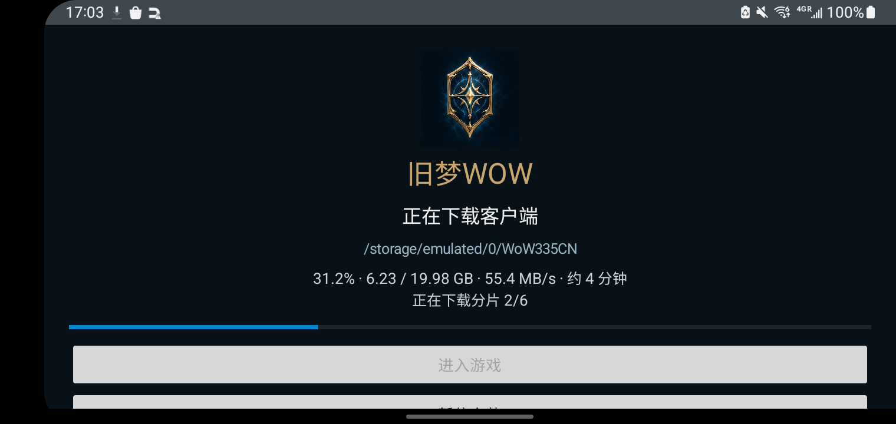
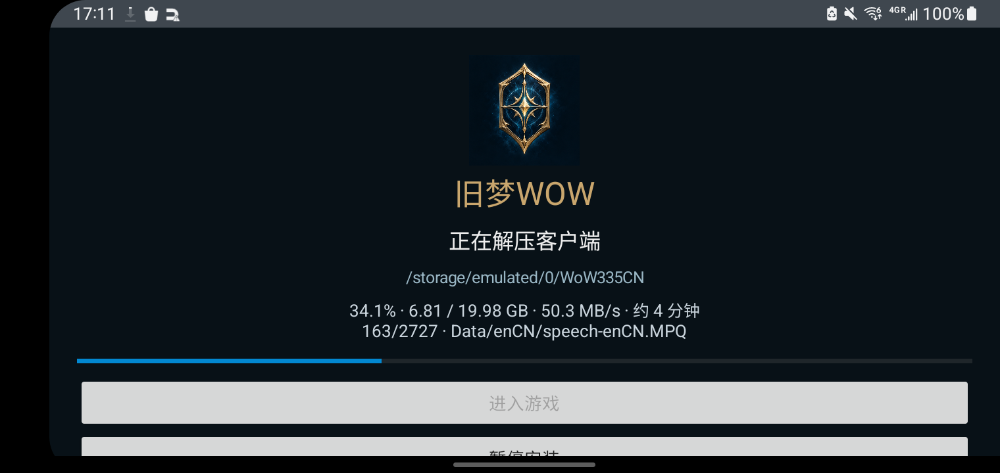

# 旧梦WOW v12：六分片客户端下载

## 源文件与实现

原单文件ZIP已移除。当前服务器`E:\rxdev\webhost\wow`提供`WoW-3.3.5a-zhCN.zip.001`至`.006`，前五片各3,670,016,000字节，第六片1,632,143,800字节，总计19,982,223,800字节。这是普通ZIP的字节切片，不是包含独立目录的六个ZIP。

- App按顺序请求六片，将内容直接追加到原有`client.zip.part`，全部校验成功后切换为`client.zip`并复用现有安全解压流程。不另建一份20GB合并副本。
- 下载显示累计进度、速度及当前分片编号。每片完成后按发布目录`parts_checksums.txt`中的SHA-256校验，校验阶段单独显示进度；解压继续校验各条目CRC及路径安全。
- 暂停或进程退出后，按已保存累计字节定位当前分片与片内Range。已完成分片先校验后复用，不重复下载。
- 服务器忽略Range而返回200时，仅重下当前分片；错误范围或网络中断保留缓存。SHA失败丢弃出错分片及其后内容，保留此前正确分片，继续时重下出错片。
- 旧单ZIP缓存若URL和总大小匹配，可以迁移复用；SHA保护源内容一致性。已有完整游戏目录不会被覆盖，下载前20GB提醒和约45GB完整安装空间要求保留。
- 下载/校验逻辑在独立`wowmobile`目录，没有改变触控、启动宣传页或上游运行器代码，也没有改服务器限速配置。
- 六片长度与SHA为此客户端版本的固定清单；将来更换客户端内容需同步更新清单。

## 验证记录

- `:app:assembleDebug`成功（42秒）。
- 原`ClientInstallerTest`通过：单ZIP兼容、容量边界、Range、200重下、ETag、CRC、目录安全及不覆盖用户文件。
- 新`SplitClientInstallerTest`通过：实际HTTP六片、片内Range精确续传、分片边界和旧缓存迁移、错误Content-Range、200重下、SHA失败、404重试、累计容量、完整缓存复用和六片ZIP解压。
- 本机实际六片只读验证：ZIP目录2,727条目，解压合计19,981,624,668字节；读取Wow.exe 7,704,216字节，CRC b8d98b75匹配。
- S10主用户0覆盖安装成功。实机暂停时累计4,820,450,941字节（第二片内）；停止整个App后重新启动服务，缓存保留并增长到5,214,502,092字节，随后界面显示第2/6片、累计6.23GB。LAN速度约55–60MB/s。
- S10六片全部下载及SHA-256校验成功，安装缓存`client.zip`大小19,982,223,800字节，自动进入完整解压及逐条CRC校验。
- S10全量解压成功并自动发布到`/storage/emulated/0/Download/OldDream/client`，`.install`缓存自动清空；未点击进入游戏，App自动启动新下载客户端并显示宣传加载页，`48254ms; realFrame=true`后进入登录界面。已核对Wow.exe及五个基础MPQ的实际大小，均匹配完整客户端要求。未登录账号或进入世界。
- 实机全链路使用本机原有`/sdcard/WoW335CN`以外的空目标目录；验收后恢复原客户端选择，并清理本次新建的测试客户端副本，避免多占约20GB。原客户端及账号文件未被覆盖。
- 恢复后再次自动启动原客户端，`49270ms; realFrame=true`进入原登录界面，原账号名仍在；仅验证到登录页，没有进入角色。最后媒体音量0、充电常亮0、熄屏待机（Dozing），App/WoW/Wine运行进程不存在；测试客户端已删除，安装缓存为空，可用空间回到67GiB。

## APK发布

- 固定下载：[OldDreamWOW.apk](https://cloud.f-li.cn:6500/wow/OldDreamWOW.apk)。发布文件`E:\rxdev\webhost\wow\OldDreamWOW.apk`，本机副本`docs/OldDreamWOW.apk`。
- 大小170,978,473字节，SHA-256：`54ABF2BA08B3F80CBD3D6BF003ED8C3DF86F4DBEA3CDC1104FCB9DE69B8E248A`。构建、副本、发布、HTTP完整下载四份哈希一致。
