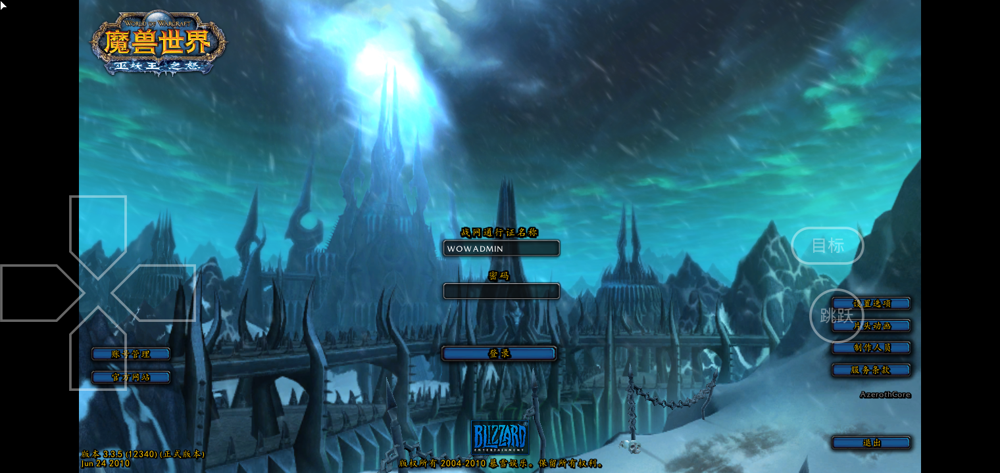

# 旧梦WOW v11：启动计时与上次成功耗时

## 当前界面

- 保留旧梦宣传图和正在启动游戏文案，提示改为“预计30–120秒，请稍候。”
- 删除“预计启动进度”和“已等待xx秒”；底部左侧显示`00:00`形式的真实计时，按分钟滚动为`01:00`、`02:01`，右侧保留两位小数百分比和金色进度条。
- 超过120秒才显示“查看游戏画面”按钮与长等待提示。120秒及之前不显示该入口。

## 百分比与耗时记录

- 新设备没有成功记录时，以60秒作为首次曲线基准。
- 本次启动达到上次成功耗时时，曲线平滑推进到90%；若仍未完成，则继续缓慢推进，最高99.50%。检测到游戏画面时才到100.00%，短暂停留后进入游戏。
- 成功耗时以加载页开始到连续两次检测到实际游戏画面为准，记录在App私有配置`olddream_startup`的`last_success_ms`。下一次启动读取该值，匹配本机启动速度。
- 手动查看画面、取消、退出或没有检测到成功画面时不更新成功记录。该记录保留于覆盖安装；全新设备或清除App数据后重新学习。
- 百分比根据本机真实历史耗时推进，并非Wine内部资源加载量；是否完成仍由实际画面判定。

## 验证

- JDK17执行`:app:assembleDebug`，构建成功（42秒）。
- `StartupProgressTest`通过：历史耗时影响曲线、平滑单调增长、超过历史后继续增长且不提前100%、分钟计时滚动、120秒入口边界。
- `StartupFrameReadinessTest`通过：黑屏/鼠标指针/单色清屏不会判断为完成；正常与暗场景可以完成。
- S10主用户0覆盖安装成功。首次读取默认`previousDurationMs=60000`，`47054ms; realFrame=true`自动进入登录页；私有配置实际保存`last_success_ms=47052`。截图显示底部`00:21`，删除了原进度标题和上方秒数。
- 再次启动日志读取`previousDurationMs=47052`；24秒左右显示46.75%，证明重新打开App后曲线使用上一轮本机耗时。
- 临时SIGSTOP本次测试的Wow.exe模拟慢启动：`01:38`时没有查看按钮，`02:25`时出现慢启动提示和“查看游戏画面”按钮，进度99.35%而非提前100%。这次人工暂停不代表正常启动耗时。
- 点击查看画面后日志`182868ms; realFrame=false`，记录仍是47052；确认手动查看不会把测试长等待写入成功记录。随后SIGCONT恢复并停止该次测试进程，再进行正常启动验证。
- 最后一次正常启动仍读取`previousDurationMs=47052`，截图`00:22 / 42.21%`；`47637ms; realFrame=true`自动进入登录页，成功记录更新为47635。验证没有受到人工暂停测试污染。
- 收尾ADB确认媒体音量0、充电常亮设置0、`mWakefulness=Dozing`（熄屏待机显示状态）；App/WoW/Wine运行进程不存在。

## APK发布

- 固定下载：[OldDreamWOW.apk](https://cloud.f-li.cn:6500/wow/OldDreamWOW.apk)。固定发布文件`E:\rxdev\webhost\wow\OldDreamWOW.apk`，本机副本`docs/OldDreamWOW.apk`。
- 大小170,972,966字节，SHA-256：`E7485D281D3CD24C4D0FC5E10AF66036B6254E607BAC7479F64AEB9C563D7C6B`。构建、本机副本、发布文件、HTTP完整下载四份哈希一致。

新设备自动/手动项见[安装设置清单](OldDreamWOW_New_Device_Setup_Checklist.md)。
