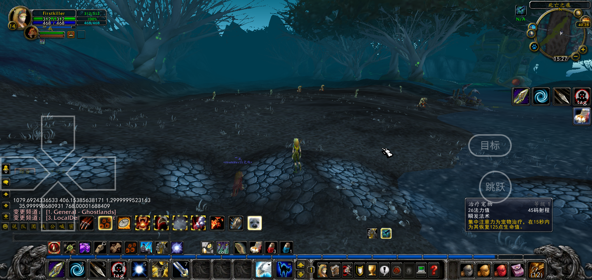
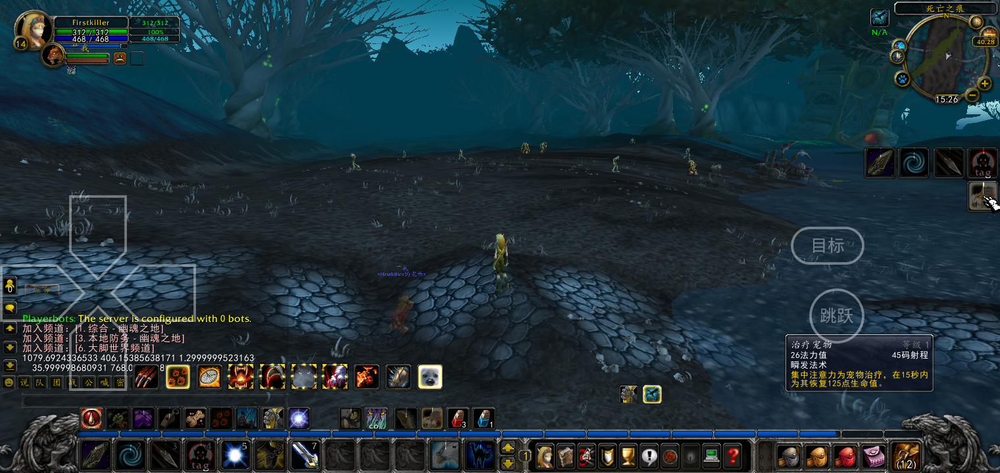
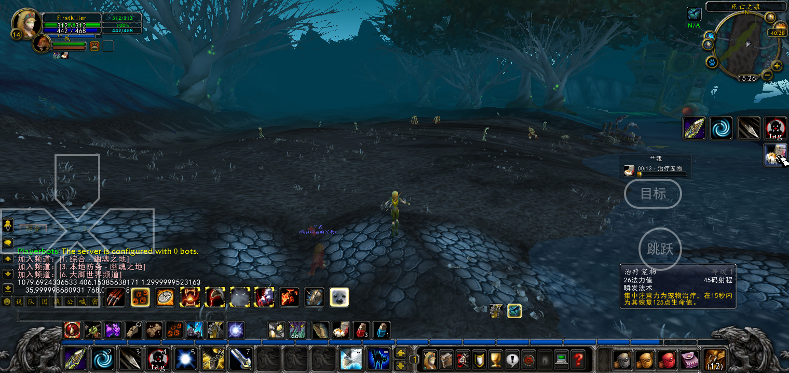
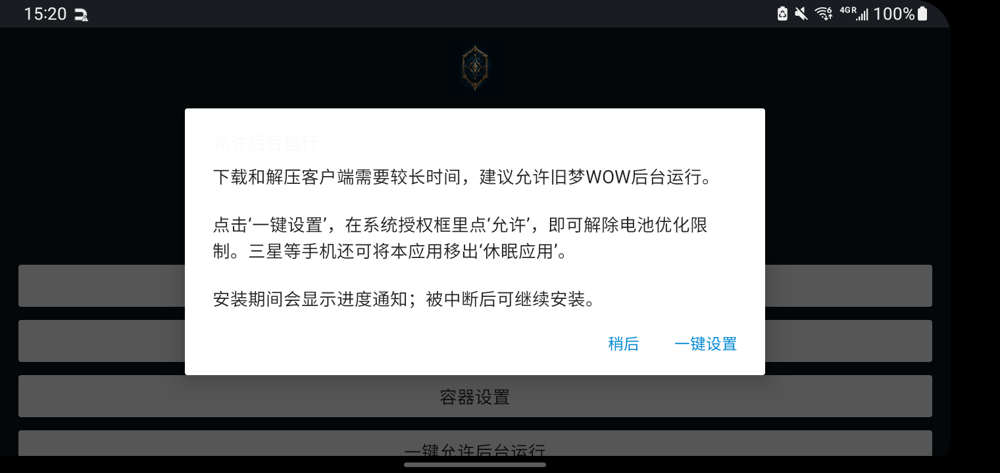
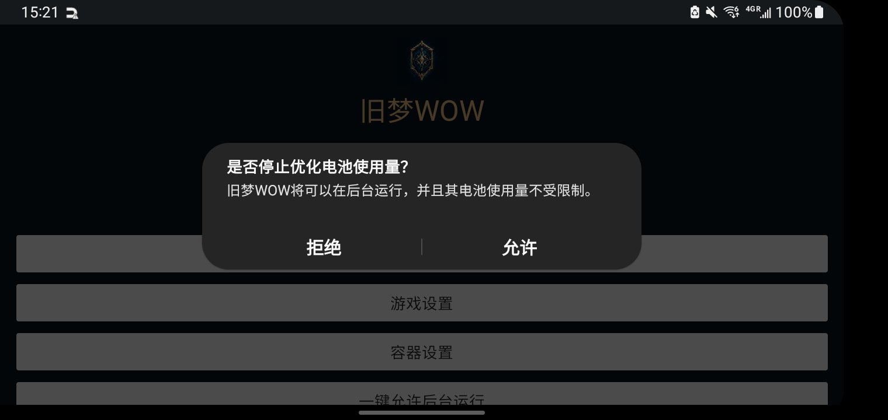
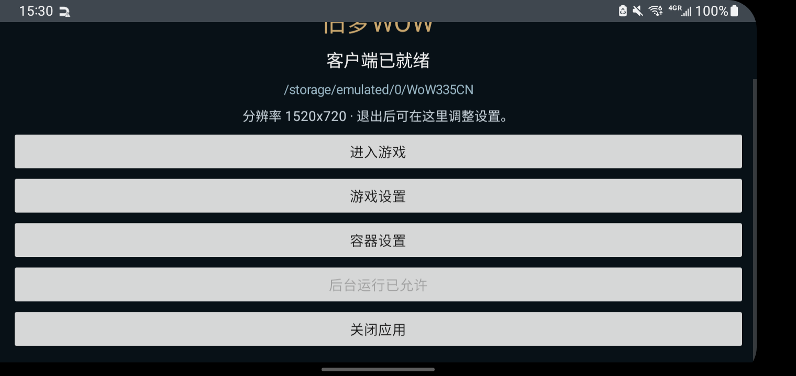

# 旧梦WOW v9：容量检查、后台授权与右侧触控微调

## 下载前容量检查

- 点击下载或继续安装时，先检查缓存目录所在存储的可用容量。缓存目录尚未创建时向上查找已有目录，避免把不存在的路径误判为零容量。
- 可用空间小于20,000,000,000字节（20 GB）时，弹窗显示当前可用容量并提示清理；此时不启动下载服务。
- 20 GB只是最低提示门槛。原服务仍根据ZIP大小、断点缓存及解压数据检查实际需求；全新下载安装建议预留45 GB。已有完整客户端启动不经过下载容量门槛。

## 首次打开与一键后台授权

- 未获授权时首次打开提示“允许后台运行”，点击“一键设置”直接打开Android系统电池优化豁免授权框；用户在系统框内点“允许”即可。
- 提示可以选择“稍后”，之后不重复打扰；启动页保留“一键允许后台运行”按钮。已授权时显示“后台运行已允许”。
- 授权弹窗与系统授权页显示期间暂缓自动进入游戏，返回后继续原来的自动启动流程。普通再次冷启动仍直接运行已有客户端。
- 下载/解压继续使用原前台服务、静音进度通知和CPU唤醒锁；完成或暂停后释放。系统授权降低后台中断概率，不能保证所有厂商永不终止进程；三星额外休眠列表可在系统设置移除。本次不让游戏退出后常驻运行。
- 改动限于独立wowmobile实现及一项Android权限声明，未修改上游公共引擎。

## 右侧动作条与目标/跳跃

- 两条12格动作条各排成两列六行，总共四列。这是触控布局设计，并非分辨率自动把PC动作条拆分。
- 独立Lua插件v6将右栏缩放从1.20改为1.30（增加8.33%），保持原始技能槽与显隐规则。高度720、S10宽1520及其他界面比例保持。
- S10的36单位技能图标由40.5渲染像素增加到43.875像素；四列左边缘约1315.875像素、上边225、下边524.8125。
- “目标”中心移至(1258,374)，“跳跃”移至(1272,482)。两按钮描边右缘约1313.875，与动作条左缘间距约2像素；跳跃下缘约523.875，与动作条底边接近。
- 保留玩家自定义位置，只迁移旧默认坐标。左侧方向键位置保持已修复的完整贴边布局。
- 自动识别正式v5及早期v5原始脚本进行升级；玩家自行改过的Lua仍保留。S10旧客户端中实际存的是早期v5，检查差异后加入精确匹配，避免误把我们之前发布的脚本当成玩家自定义版本。

## 验证记录

- JDK17执行`:app:assembleDebug`成功。已有AGP/SDK版本与native packaging警告保持，未阻止构建。
- 独立`ClientInstallerTest`通过：20 GB上下边界、缺失缓存目录父卷、空间不足阻止创建下载分片、Range断点、HTTP200重启、ETag变更、CRC错误、路径检查及用户文件保留。
- S10 Android12实测首次提示 → 一键设置 → 系统“允许”框；确认后`dumpsys deviceidle whitelist`出现`user,it.wowmobile,10354`。
- 设备可用容量约67 GiB，本次不填满手机模拟低容量，不重复下载20 GB生产客户端；低容量分支以边界和文件/HTTP回归验证。完整下载安装实测见v8记录。
- 最终APK安装到S10主用户0，工作资料用户10无此应用；后台白名单保持。再次冷启动未重复提示，已有客户端自动启动，旧v5脚本自动升级为v6，登录进入世界正常。
- 游戏实际输出`MultiBarLeft:GetLeft()=1079.6924336553`、`GetTop()=406.15385638171`、有效缩放约1.30、按钮宽36、UI画布高度768；折算720渲染与上面的2像素间距一致。方向键左侧描边完整，右栏不裁切。
- 新位置跳跃正常；右侧(1494,298)长按命中“治疗宠物”，显示技能提示并触发技能。玩家只有少量已填技能，空槽沿用原隐藏规则，截图不会把24个格子全部显示出来。未测试其他机型。

游戏内布局与触控截图：

首次提示与系统授权截图：

收尾：已关闭旧梦WOW、Wow.exe和Wine进程，无安装服务残留；媒体音量0、充电常亮关闭、屏幕Dozing。原`WoW335CN/Wow.exe`保留，工作资料用户10未安装应用。

## APK发布

- 固定文件名：`E:\rxdev\webhost\wow\OldDreamWOW.apk`，本机副本`docs/OldDreamWOW.apk`。
- 下载：[旧梦WOW APK](https://cloud.f-li.cn:6500/wow/OldDreamWOW.apk)。
- 文件大小：168,125,255字节。SHA-256：`91415B87D2A9F566D118642F7C5436D033EC821CFE187E1063CE66E0964F1050`。
- 构建、发布复制与HTTP下载完整APK的SHA-256一致。版本号继续3/0.1.2，保留玩家触控配置。
