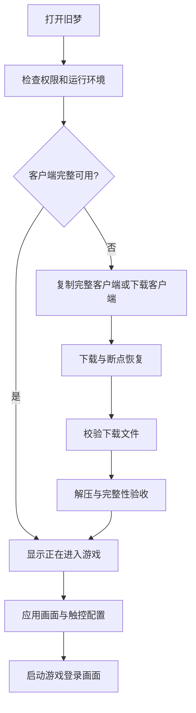

> 更新：本文件前期固定宽1280方案已被用户最新要求替代。当前实现固定高720、按屏幕比例算宽，S10为1520×720，名称旧梦WOW。详见 [最新实现](OldDreamWOW_Bootstrap_and_720p_20261005.md)。

# 旧梦：屏幕显示和客户端自动准备流程复核

日期：2026-10-05。本文为方案复核；自动下载、解压和直启尚未实现。当前本机 v6 已改名为旧梦，显示使用 1280×720 等比基准；普通/宽屏自动选择仍待落实。

## 1. 显示方案

两套固定分辨率不能完全覆盖 Android 的 16:9、18.5:9、19:9、19.5:9、20:9、平板和折叠屏比例。要兼顾铺满、不裁切和不失真，推荐：

- 产品层保留普通屏、宽屏两档，维护两种布局密度；字体与图标共用规则。
- 底层固定渲染宽度 1280，按游戏实际可用显示区域计算偶数高度：`H = round(1280 × 可用高度 / 可用宽度 / 2) × 2`。
- 使用统一等比显示和现有实际 viewport 的触点逆映射。整数像素误差仅产生极窄边缘，不允许分别拉伸 X/Y。
- 应使用横屏实际游戏显示区域，包含实际系统栏/刘海处理结果，不能依据 App 首页的竖屏尺寸计算。尺寸变化只在游戏启动前应用，避免游戏中途修改桌面分辨率。
- 分辨率是渲染基准，不是芯片兼容或通用帧率保证。对各 GPU 的 Wine/图形驱动兼容性仍需独立验证。

| 屏幕比例 | 渲染尺寸示例 | 像素数 |
| --- | --- | ---: |
| 16:9 | 1280×720 | 921,600 |
| 19:9，S10 当前 1520×720 区域 | 1280×606 | 775,680 |
| 20:9 | 1280×576 | 737,280 |

720p 比此前 1280×1024 少 29.69% 像素；S10 按比例的 1280×606 少 40.82%。此前 960×432 为 414,720 像素。像素数变化不能直接换算成帧率变化。

Android 官方也建议在无法支持任意比例时使用等比显示而非失真拉伸，并测试不同显示配置：[屏幕尺寸与比例处理](https://developer.android.com/games/develop/multiplatform/support-large-screen-resizability)。

## 2. 推荐目录与发现规则

新安装公开目录：`/storage/emulated/0/Download/OldDream/client`。目录名用英文，便于复制和 Wine 文件映射；App 和玩家界面使用“旧梦”。不放在容易被卸载清掉、又不方便手动复制的 Android/data 路径。

检测顺序：

1. 用户已保存的有效路径。
2. 推荐目录。
3. 现有兼容路径 `/storage/emulated/0/WoW335CN`。

不扫描全盘，不搬动已存在的约 20 GB 客户端。每次打开做快速文件检查，不重复完整哈希扫描。除了 Wow.exe，应检查关键 Data/*.MPQ、语言资源和配置可读性；完整校验只在安装/导入时进行，并写就绪标记。发现残缺目录时显示继续安装或修复，禁止直接运行。

公共目录在较新 Android 版本上需要明确处理存储授权。当前 targetSdk 28 的历史存储模式不能代替后续新 Android 的授权兼容验证。

## 3. 玩家流程

正常启动不显示 Winlator/WoW Mobile 首页；保留很短的“旧梦 · 正在进入游戏”状态页，让运行环境初始化期间不会像假死。游戏退出后停留在“已退出游戏 / 再次进入 / 设置”，不在 onResume 自动重新启动。原来的服务器、触控和高级设置通过游戏菜单或退出页进入。

首次缺失页只给“我已复制，重新检查”和“下载客户端”两个主要动作，明确显示指定路径、包大小和所需空间。手机现有完整客户端走直接启动路径，无需下载。

## 4. 已验证的下载源

下载文件：[WoW-3.3.5a-zhCN.zip](https://cloud.f-li.cn:6500/wow/WoW-3.3.5a-zhCN.zip)。

验证方式：HTTPS HEAD + 仅下载末尾 1 MiB 读取 ZIP 目录；没有下载整包。

- HTTP 200，Content-Length **19,981,061,620** 字节，约 **18.61 GiB**。
- `Accept-Ranges: bytes`，实际末尾范围读取成功，可作为断点续传基础。
- 解压文件合计 **19,980,557,200** 字节，约 **18.61 GiB**；2,300 个条目，没有加密条目。
- ZIP 内部有一层 `WoW-3.3.5a-zhCN/`，安装器需去掉这一层，使最终 `client/Wow.exe` 直接存在。
- 各条目使用 stored 方法，打包大小与解包大小基本一致。仅改成 ZIP 压缩不保证明显缩小，因为游戏 MPQ 自身已包含压缩数据。
- 包内无 WTF/Account、Cache、Logs 文件。包含 enCN 和 zhCN 语言文件；若以后只发布简体中文精简包，需验证游戏所需资源后再制作，不能直接删语言目录。
- 压缩包 + 解压结果 + 3 GiB 余量约 **40.22 GiB**，推荐页面提示“至少约 45 GB（41 GiB）可用空间”。当前 S10 剩余约 67 GiB，现有客户端约 18.68 GiB。

完整 HTTP ZIP 比百度网盘分卷更适合 App 自动安装。网盘分卷涉及网页授权、多个文件及特定解压格式，不作为内置主下载路径；用户仍可在电脑解压完整客户端后手动复制。

## 5. 下载、解压与失败恢复

- 下载显示百分比、已下载/总大小、实时速度和估计剩余时间；提供暂停、继续，后台保留通知。使用前台下载任务，避免熄屏或切后台后静默中断。
- 全部字节数使用 long。复用现有下载器会在约 2 GB 之后溢出，且没有 Range 续传，不能直接用于本文件。
- `.part` 与 ETag/Last-Modified 元数据持久保存，Range + If-Range 恢复。服务器返回完整 200 时重新下载，不能把整包错误拼到半包之后。
- 先下载再解压，文件长度和校验通过后进入安装。解压进度按实际已写入字节/目录声明总大小计算，另显示文件数；大 MPQ 解压期间也持续刷新，不能只在切换文件时更新。
- 到独立 staging 目录解压，检查目录逃逸、符号链接、条目实际大小和 CRC。全部验收完成后同卷重命名为 client，避免断电后把半安装目录当成功。
- 成功后只删除本次下载安装器自己创建的 ZIP/staging；已有客户端和用户手动提供的文件不删除。
- 下载失败保留可续传状态；解压失败保留完整 ZIP供重试。空间不足先说明缺多少，不开始新的大文件下载。
- 建议下载源附版本、大小、SHA-256 和必要文件列表的 manifest，避免只依赖服务器文件名。此 manifest 还未生成。

## 6. 实施入口与待验证项

可复用 `Provisioner`、`WowContainerHelper` 和实际 viewport 触点映射。新增启动调度、持久下载任务、安全解压器和客户端验收。

`RootFSInstaller` 当前没有完成回调；自动启动必须等待运行环境安装完成。启动调度只能发起一次，不能因权限返回、旋转屏幕或 onResume 重复进游戏。新客户端默认服务器应指向旧梦的 cloud.f-li.cn，同时保留用户已有明确服务器设置。

待验收：已有客户端直启、复制目录识别、残缺检测、暂停/断网/重启恢复、空间不足、解压中断重试、完整约20GB实机下载安装、不同屏幕比例的图标文字与触点，以及游戏退出后不循环启动。

当前完成的品牌改名和 720p 基准 APK：`OldDream_Native_Touch_debug_20261005_v6.apk`；构建成功，main profile 安装成功，APK标签/手机首页为“旧梦”，登录画面已确认等比显示。自动客户端管理与普通/宽屏方案在本文中为待实施设计，未宣称已完成。

当前基准源码提交 `4f8682a`，已推送 `feature/wow-native-touch`。APK SHA-256：`64FA208D90C43465B5D5D46012D7D47727855B424ED88AD52F04AE0890D43413`。字体变更已构建，当前 v6 游戏内技能栏/背包/文字未完成整体验收；此轮重点为新流程复核与品牌验证。手机已停止游戏和应用，保持媒体音量 0、USB 常亮 0并熄屏。
